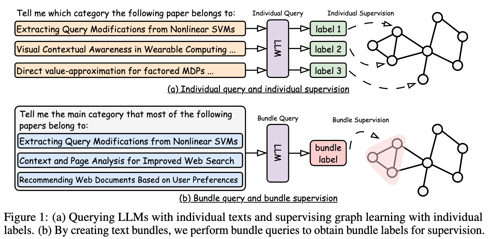
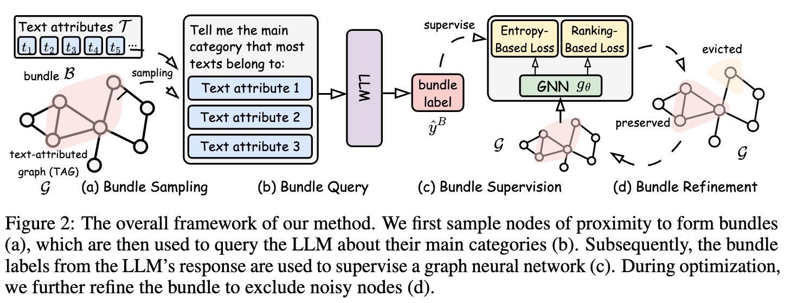

# Code for paper "Dynamic Bundling with Large Language Models for Zero-Shot Inference on Text-Attributed Graphs" Accepted by NeurIPS 2025

This repository contains the code for the paper "Dynamic Bundling with Large Language Models for Zero-Shot Inference on Text-Attributed Graphs" [[PDF]](https://openreview.net/pdf/d615b950a359ab4cc2684209840bedfc61f6d59e.pdf). To reproduce the results, please follow the instructions below.

## About the Paper
### Abstract
Large language models (LLMs) have been used in many zero-shot learning problems, with their strong generalization ability. Recently, adopting LLMs in text-attributed graphs (TAGs) has drawn increasing attention. However, the adoption of LLMs faces two major challenges: limited information on graph structure and unreliable responses. LLMs struggle with text attributes isolated from the graph topology. Worse still, they yield unreliable predictions due to both information insufficiency and the inherent weakness of LLMs (e.g., hallucination). Towards this end, this paper proposes a novel method named Dynamic Text Bundling Supervision (DENSE) that queries LLMs with bundles of texts to obtain bundle-level labels and uses these labels to supervise graph neural networks. Specifically, we sample a set of bundles, each containing a set of nodes with corresponding texts of close proximity. We then query LLMs with the bundled texts to obtain the label of each bundle. Subsequently, the bundle labels are used to supervise the optimization of graph neural networks, and the bundles are further refined to exclude noisy items. To justify our design, we also provide theoretical analysis of the proposed method. Extensive experiments across ten datasets validate the effectiveness of the proposed method.

### Individual Query v.s. Bundled Query


### Overall Framework


## Environmental Setup
Use the following command in a linux system to prepare the environment:
```bash
conda create -n llmbp python==3.8.18 
conda activate llmbp
conda install pytorch==2.1.2 torchvision==0.16.2 torchaudio==2.1.2 pytorch-cuda=12.1 -c pytorch -c nvidia
pip install pyg_lib==0.3.1+pt21cu121 -f https://data.pyg.org/whl/torch-2.1.0+cu121.html 
pip install torch_scatter==2.1.2 -f https://data.pyg.org/whl/torch-2.1.0+cu121.html 
pip install torch_sparse==0.6.18+pt21cu121 -f https://data.pyg.org/whl/torch-2.1.0+cu121.html 
pip install torch_cluster==1.6.3+pt21cu121 -f https://data.pyg.org/whl/torch-2.1.0+cu121.html 
pip install torch_spline_conv==1.2.2+pt21cu121 -f https://data.pyg.org/whl/torch-2.1.0+cu121.html
pip install transformers==4.46.3 
pip install sentence_transformers==2.2.2
pip install dgl==2.4.0+cu121 -f https://data.dgl.ai/wheels/torch-2.1/cu121/repo.html 
pip install openai 
pip install torch_geometric==2.5.0 
pip install protobuf 
pip install accelerate
```

## Data Setup
Download the data from the following Hugging Face Repository provided by Wang et al. [[Link]](https://huggingface.co/datasets/Graph-COM/Text-Attributed-Graphs)

Put the data in `dataset/` folder.

## Model Setup
Please set your OpenAI API key as follows:
```bash
export OPENAI_API_KEY=<your_api_key>
```

## Running the Code
Please use the following command to run the code:
```bash
python bundle.py --device 6 --dataset bookchild --bundle_size 5 --num_samples 100 --sample_criterion neighbor --max_hop 3 --query_type gpt --model gpt-4o --loss_type ranking --gnn_type gcn --stages 300 100 100 --valid --lr 0.001 --wd 0.001 --resample --repeat 1
python bundle.py --device 6 --dataset citeseer --bundle_size 5 --num_samples 100 --sample_criterion neighbor --max_hop 2 --query_type gpt --model gpt-4o --loss_type ranking --gnn_type sage --stages 300 100 100 --valid --lr 0.001 --wd 0.001 --resample --repeat 1
python bundle.py --device 6 --dataset cora --bundle_size 5 --num_samples 100 --sample_criterion neighbor --max_hop 2 --query_type gpt --model gpt-4o --loss_type ranking --gnn_type gin --stages 400 100 100 --valid --lr 0.001 --wd 0.001 --resample --repeat 1
python bundle.py --device 0 --dataset cornell --bundle_size 5 --num_samples 100 --sample_criterion feature --max_hop 3 --query_type gpt --model gpt-4o --loss_type ranking --gnn_type glognn --num_layers 1 --stages 300 100 100 --valid --lr 0.001 --wd 0.001 --resample --repeat 1
python bundle.py --device 0 --dataset bookhis --bundle_size 5 --num_samples 100 --sample_criterion neighbor --max_hop 2 --query_type gpt --model gpt-4o --loss_type ranking --gnn_type gcn --stages 300 100 100 --valid --lr 0.001 --wd 0.001 --resample --repeat 1
python bundle.py --device 6 --dataset sportsfit --bundle_size 5 --num_samples 100 --sample_criterion neighbor --max_hop 3 --query_type gpt --model gpt-4o --loss_type ranking --gnn_type gcn --stages 300 100 100 --valid --lr 0.001 --wd 0.001 --resample --repeat 1
python bundle.py --device 0 --dataset texas --bundle_size 5 --num_samples 100 --sample_criterion feature --max_hop 3 --query_type gpt --model gpt-4o --loss_type ranking --gnn_type glognn --num_layers 1 --stages 300 100 100 --valid --lr 0.001 --wd 0.001 --resample --repeat 1
python bundle.py --device 0 --dataset washington --bundle_size 5 --num_samples 100 --sample_criterion feature --max_hop 3 --query_type gpt --model gpt-4o --loss_type ranking --gnn_type glognn --num_layers 1 --stages 300 100 100 --valid --lr 0.001 --wd 0.001 --resample --repeat 1
python bundle.py --device 6 --dataset wikics --bundle_size 5 --num_samples 100 --sample_criterion hybrid --max_hop 2 --query_type gpt --model gpt-4o --loss_type ranking --gnn_type sage --num_layers 3 --dropout 0 --edge_dropping 0 --stages 400 100 100 100 100 --valid --lr 0.001 --wd 0.001 --resample --repeat 1
python bundle.py --device 0 --dataset wisconsin --bundle_size 5 --num_samples 100 --sample_criterion feature --max_hop 3 --query_type gpt --model gpt-4o --loss_type ranking --gnn_type glognn --num_layers 1 --stages 300 100 100 --valid --lr 0.001 --wd 0.001 --resample --repeat 1
```

## Acknowledgement
* Wang et al. Model Generalization on Text Attribute Graphs: Principles with Large Language Models. In ICML 2025 (https://github.com/Graph-COM/LLM_BP)
* Li et al. Finding Global Homophily in Graph Neural Networks When Meeting Heterophily. In ICML 2022 (https://github.com/RecklessRonan/GloGNN)

## Citation
```
@inproceedings{zhao2025dynamic,
  title={Dynamic Bundling with Large Language Models for Zero-Shot Inference on Text-Attributed Graphs},
  author={Zhao, Yusheng and Zhang, Qixin and Luo, Xiao and Zhang, Weizhi and Xiao, Zhiping and Ju, Wei and Yu, Philip S and Zhang, Ming},
  booktitle={The Thirty-ninth Annual Conference on Neural Information Processing Systems},
  year={2025}
}
```